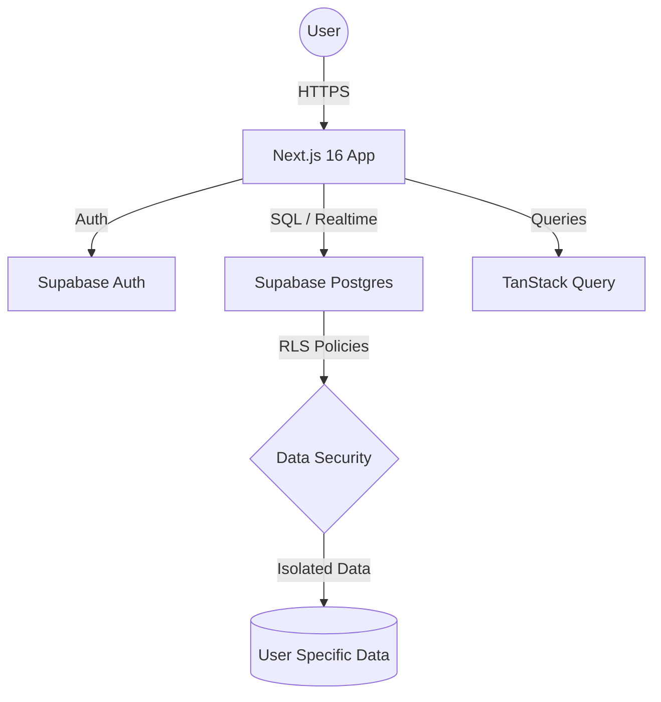

# 🚀 FinPal ERP System: Integrated Business Management Solution

[](https://nextjs.org/)
[](https://react.dev/)
[](https://supabase.com/)
[](https://tailwindcss.com/)
[](https://opensource.org/licenses/MIT)

**FinPal ERP** is a modern, full-stack Enterprise Resource Planning (ERP) system designed specifically for Small and Medium Enterprises (SMEs) in the Kenyan market. It streamlines complex business operations—from inventory and sales to financial reporting and accounting—into a single, cohesive platform.

---

## 📑 Table of Contents

- [Core Modules](#-core-modules)
- [System Architecture](#-system-architecture)
- [Tech Stack](#-tech-stack)
- [Key Features](#-key-features)
- [Database Schema](#-database-schema)
- [Getting Started](#-getting-started)
- [Project Structure](#-project-structure)
- [Reporting Suite](#-reporting-suite)
- [Security & Compliance](#-security--compliance)
- [License](#-license)

---

## 🏗️ Core Modules

### 1. 📂 Financial & Accounting
- **Chart of Accounts**: Comprehensive ledger management with hierarchical accounts.
- **Journal Entries**: Double-entry bookkeeping for all financial transactions.
- **General Ledger**: Real-time tracking of all account balances.
- **Trial Balance**: Automated verification of ledger accuracy.

### 2. 👥 CRM & Stakeholder Management
- **Customer Portal**: Detailed profiles, transaction history, and outstanding balances.
- **Supplier Directory**: Vendor management with purchase history and aged payables tracking.

### 3. 📦 Inventory & Stock Control
- **Product Catalog**: SKU tracking, categorization, and pricing management.
- **Real-time Stock**: Automated updates on sales/purchase transactions.
- **Reorder Point Alerts**: Proactive notifications for low-stock items.

### 4. 🛒 Sales & Revenue
- **Order Management**: End-to-end sales lifecycle from order to fulfillment.
- **Invoicing**: Professional PDF invoice generation.
- **Payment Collection**: Integration with M-Pesa, bank transfers, and cash.

### 5. 📥 Procurement
- **Purchase Orders**: Systematic ordering process with supplier tracking.
- **Receiving**: Inventory updates upon delivery confirmation.

---

## 🌐 System Architecture



---

## 🛠️ Tech Stack

- **Framework**: [Next.js 16](https://next.js) (App Router, Server Components)
- **Frontend**: [React 19](https://react.dev), [TypeScript](https://typescriptlang.org)
- **Styling**: [Tailwind CSS v4](https://tailwindcss.com), [Shadcn/UI](https://ui.shadcn.com)
- **Database**: [Supabase](https://supabase.com) (PostgreSQL)
- **State Management**: [TanStack React Query v5](https://tanstack.com/query)
- **Forms**: React Hook Form + Zod Validation
- **Visuals**: [Recharts](https://recharts.org), [Lucide React](https://lucide.dev)
- **Reporting**: jspdf, html2canvas, xlsx (Export functionality)

---

## 📊 Reporting Suite

FinPal provides a robust suite of financial reports essential for business health monitoring:

| Report | Description |
| :--- | :--- |
| **Balance Sheet** | Real-time snapshot of Assets, Liabilities, and Equity. |
| **Profit & Loss** | Comprehensive view of Revenue vs. Expenses. |
| **Cash Flow** | Tracking of liquidity through operational activities. |
| **Trial Balance** | Summary of all account balances for audit purposes. |
| **Aged Receivables** | Detailed breakdown of outstanding customer payments. |
| **Aged Payables** | Overview of upcoming supplier obligations. |

---

## 🗄️ Database Schema

The system uses a highly relational PostgreSQL schema optimized for ERP performance:

- **`profiles`**: User-specific preferences and settings.
- **`chart_of_accounts`**: The financial backbone of the system.
- **`inventory`**: Products, stock levels, and pricing.
- **`customers` / `suppliers`**: Stakeholder entities.
- **`invoices` / `purchase_orders`**: Transactional headers.
- **`payments`**: Linked to specific invoices/purchases.

> [!IMPORTANT]
> **Row Level Security (RLS)** is strictly enforced. Users can only access data belonging to their organization/profile.

---

## 🚀 Getting Started

### Prerequisites
- Node.js 18.17+ or 20+
- A Supabase Project ([Create one here](https://supabase.com))

### 1. Installation
```bash
git clone https://github.com/your-username/erp-finpal-system.git
cd erp-finpal-system
npm install
```

### 2. Environment Setup
Create a `.env.local` file:
```bash
NEXT_PUBLIC_SUPABASE_URL=your_project_url
NEXT_PUBLIC_SUPABASE_ANON_KEY=your_anon_key
DATABASE_URL=your_postgres_connection_string
```

### 3. Database Migration
```bash
# Set up initial schema and seed data
npm run migrate
```

### 4. Development Server
```bash
npm run dev
```
Visit `http://localhost:3000` to see your ERP in action.

---

## 📁 Project Structure

```text
├── app/                  # Next.js App Router (Pages & Layouts)
├── components/           # UI Components (Dashboard & Shared)
├── hooks/                # Custom React Hooks
├── lib/                  # Business Logic, Supabase Client & Queries
├── public/               # Static Assets
├── scripts/              # Database maintenance & Migrations
├── supabase/             # SQL Migrations & Schema definitions
└── types/                # Global TypeScript Interfaces
```

---

## 🔐 Security & Compliance

1. **Authentication**: Handled via Supabase SSR Auth with session persistence.
2. **Data Integrity**: Enforced via PostgreSQL foreign key constraints and triggers.
3. **Data Isolation**: Multi-tenant architecture via Row Level Security (RLS).
4. **Validation**: Strict client and server-side validation using ZOD.

---

## 🤝 Contributing

We welcome contributions! Please follow these steps:
1. Fork the Project.
2. Create your Feature Branch (`git checkout -b feature/AmazingFeature`).
3. Commit your Changes (`git commit -m 'Add AmazingFeature'`).
4. Push to the Branch (`git push origin feature/AmazingFeature`).
5. Open a Pull Request.

---

## 📄 License

Distributed under the MIT License. See `LICENSE` for more information.

---

**Built with ❤️ for Modern Businesses**
